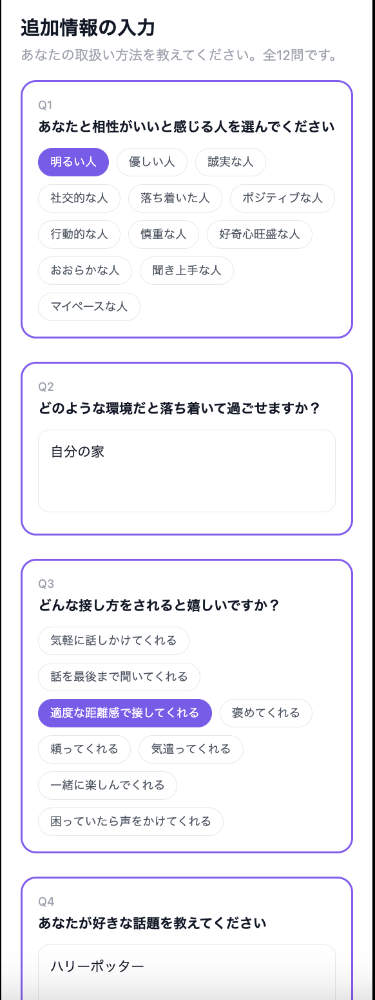
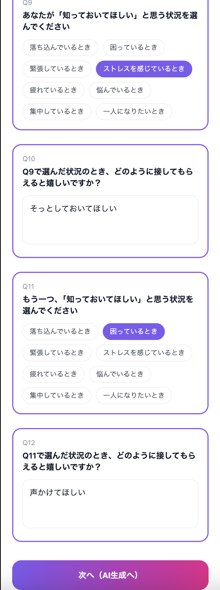
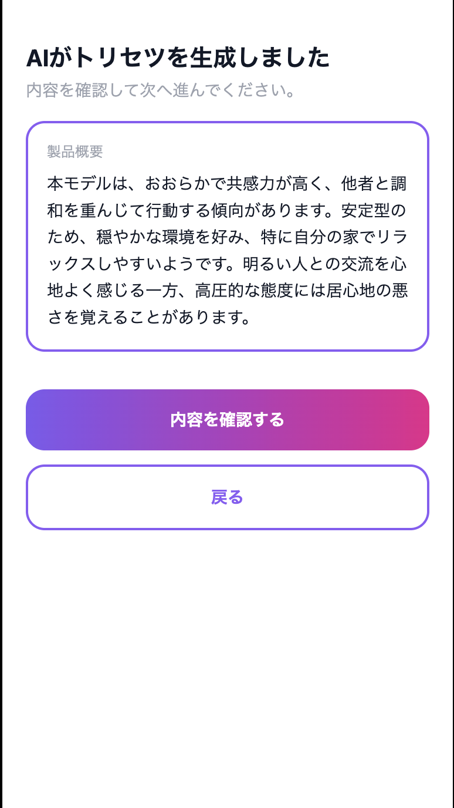
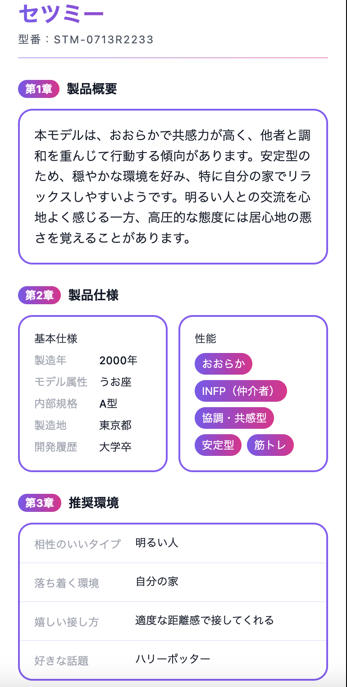
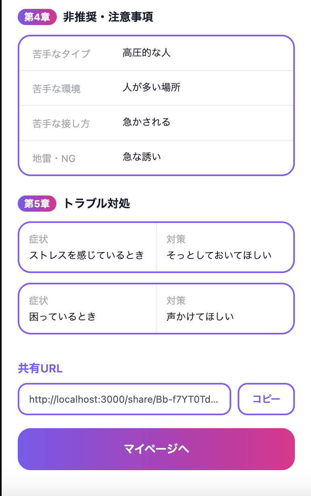
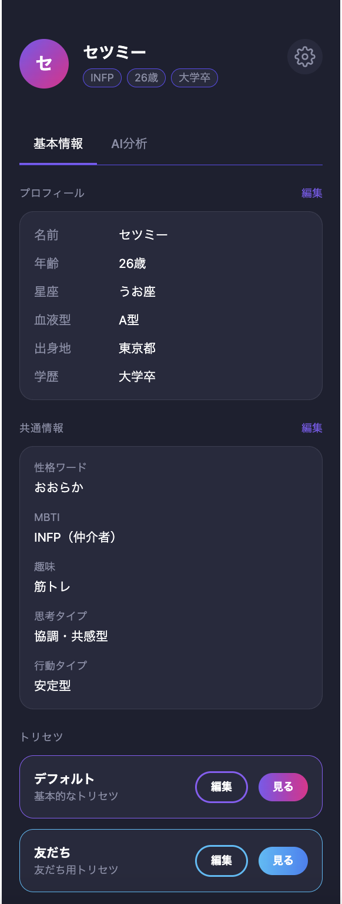

# SETSU：Me（セツミー）

> **自分のことをうまく伝えられない人のための「取扱説明書」生成サービス**

---

## サービスURL

**SETSU：Me**  
https://setsu-me.onrender.com

---

## サービス概要

SETSU：Meは、**新しい環境で自分のことを相手に伝えることが苦手な人に向けたWebサービス**です。

「自分のことを知ってほしいけどうまく伝えられない」という課題に対し、性格や価値観などの質問に回答すると、**AIが回答内容を分析・文章化し、その人だけの「取扱説明書」を生成します。**

生成した取扱説明書はURLで簡単に共有できるため、  
**自分で一から説明することなく、相手に自分のことを伝えることができます。**

私自身も自分のことを言語化して伝えることが苦手だったため、

> 「こうしたサービスがあれば、もっと気軽かつ簡単に自分を知ってもらえるのではないか」

と考え制作しました。

---

## サービスの流れ

### 1. 質問に回答

性格や価値観、行動傾向、好きなことなど、  
自分に関する質問に回答します。

### 2. AIが分析・文章化

回答内容をAIが分析し、  
その人の特徴が伝わる文章に整理します。

### 3. 取扱説明書を生成

AIによって、自分専用の「取扱説明書」が生成されます。

### 4. URLで共有

発行されたURLを相手に共有することで、  
自分について一から説明することなく、簡単に伝えることができます。

---

## 開発背景・解決したい課題

新しい環境では、初対面の人に自分の性格や価値観などを伝える機会があります。

しかし、自分のことを知ってほしいと思っていても、  
**自分の性格や考え方をうまく言葉にして伝えることは難しい**と感じる人もいると思います。

私自身も、自分について説明するときに「自分のことをどう表現すればいいか分からない」と感じることがありました。

そこで、質問に答えるだけでAIが自分の特徴を分析・文章化し、**「取扱説明書」という形で表現するサービス**を考えました。

さらに、生成した取扱説明書をURLで共有できるようにすることで、

- 自分について一から説明する手間を減らす
- 自分のことを簡単に相手へ伝える

ことを目指しました。

---

## 主な機能

### ユーザー認証・アカウント管理

- メールアドレス・パスワードによるユーザー登録・ログイン
- LINEアカウントを利用したユーザー登録・ログイン
- アカウント情報の編集

### 質問への回答

性格や価値観、行動傾向、好きなことなどに関する質問に回答します。

複数の質問を通して、AIが分析するための情報を入力します。

### AIによる取扱説明書の生成

入力された回答をもとに、AIが内容を分析・文章化し、**その人だけの取扱説明書を生成**します。

### 複数テーマ

テーマの種類によって、**異なる視点や表現で取扱説明書を作成**できます。

現在は以下のテーマを実装しています。

- デフォルト
- 友だち

今後も、用途に合わせたテーマの追加を予定しています。

### マイページ

プロフィール情報や作成した取扱説明書を確認・管理できます。

また、複数のテーマから取扱説明書を作成できます。

### 取扱説明書の共有

生成した取扱説明書に専用URLを発行し、  
**登録・ログインしていない相手にも共有**できます。

---

## AI機能で工夫したこと

### 回答内容をもとにした文章生成

単純に回答内容を並べるのではなく、複数の回答をAIに渡して分析させることで、**回答同士の組み合わせや一貫性を考慮した文章**を生成するようにしています。

### テーマごとの文章生成

「デフォルト」「友だち」など、テーマによって求められる文章の雰囲気や視点が異なるため、**テーマごとにプロンプトを分けて設計**しています。

例えば、デフォルトテーマでは取扱説明書らしい形式で自分の特徴を整理し、友だちテーマではよりカジュアルな表現になるよう設計しています。

### JSON形式でのレスポンス

AIからのレスポンスをJSON形式にすることで、生成された文章をアプリ側で項目ごとに扱いやすくし、**画面上の各セクションへ適切に表示できるようにしています。**

---

## 開発で工夫したこと・挑戦したこと

### Hotwireを利用した質問フォーム

複数の質問を段階的に入力できるフォームを実装し、入力途中の情報を保持しながら、**スムーズに回答できるUI**を目指しました。

### OpenAI APIとの連携

OpenAI APIを利用した文章生成機能を実装しました。

APIへのリクエスト内容やプロンプトを調整し、ユーザーの回答から**取扱説明書として自然な文章を生成できるよう試行錯誤**しました。

また、テストではOpenAI APIを実際に呼び出さず、`instance_double`を使用してAPIクライアントをモック化し、AI生成処理を検証しています。

### Docker・Render・Neonを利用した開発・デプロイ

Dockerを利用した開発環境を構築し、Renderへのデプロイ、NeonのPostgreSQLデータベースとの接続まで行いました。

---

## テスト

RSpecを使用し、**モデル・リクエスト・サービス層**のテストを実装しています。

- モデルテスト：5ファイル
- リクエストテスト：8ファイル
- サービス層テスト：3ファイル
- LINEログインのコールバックを含むリクエストテスト
- OpenAI APIは `instance_double` でモック化し、実際のAPIを呼び出さずにAI生成処理を検証

---

## 技術構成

| 分類 | 技術 |
|---|---|
| 言語 | Ruby 3.3.8 |
| フレームワーク | Ruby on Rails 8.0.5.1 |
| データベース | PostgreSQL |
| フロントエンド | HTML / CSS / JavaScript / Hotwire |
| CSSフレームワーク | Tailwind CSS |
| 認証 | Devise |
| 外部認証 | OmniAuth / LINE Login |
| AI | OpenAI API（gpt-4o-mini） |
| テスト | RSpec |
| 開発環境 | Docker |
| デプロイ | Render |
| データベース環境 | Neon |

---

## 設計・画面

### ER図

[ER図を見る（Figma）](https://www.figma.com/design/2DebfeGwtHpmK59kxO7CS1/%E5%8D%92%E6%A5%AD%E5%88%B6%E4%BD%9C%EF%BC%88ER%E5%9B%B3%EF%BC%89?node-id=0-1&t=3KuyGMIv6kKVe84Z-1)

### 画面遷移図

[画面遷移図を見る（Figma）](https://www.figma.com/design/tWgf8ljRLd07VTkzFBV2EI/%E7%84%A1%E9%A1%8C?node-id=0-1&t=bJvMrqbKqCGqYQyc-1)

---

## 画面イメージ

### 質問への回答

### AIによる取扱説明書の生成

### 生成された取扱説明書

### マイページ・テーマ選択

---

## 今後の展望

- 取扱説明書のテーマの追加
- UI/UX向上のためのビジュアル強化（デザインの修正・グラフ表示）
- テーマごとの表現・生成内容のさらなる改善
